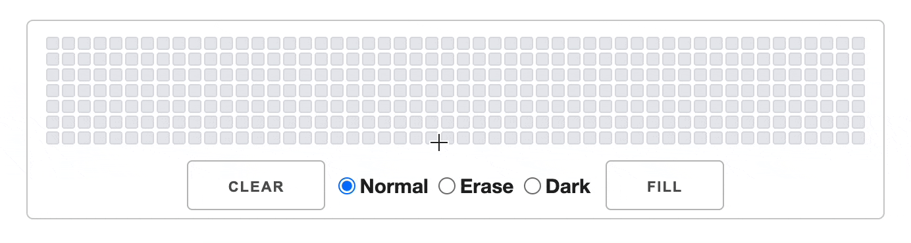

# commitCanvas
The tool that allows you to create art in your GitHub contribution graph!!  

It takes an input on an imitation graph and produces either a schedule of commits or a full-on Git repository!!  



This is my first proper project and it fills that need to draw something in your contribution graph. The first time I laid eyes on that thing, I was thinking about how can I abuse this tiny graph of cubes.

It started as a silly statement to myself that became an idea aired out on a good friend. It was something along the lines of "imagine drawing something in that over some period, that would be amazing!!". With a little bit of creative thinking and taking advantage of how Git allows commits in the past, I have piped together something. Take a look at [my working profile](https://github.com/Jordy1311?tab=overview&from=2020-12-01&to=2020-12-31) for a real-life example of the output of commitCanvas.  

> Where the spirit does not work with the hand, there is no art.

A man named Leonardo da Vinci once said this and living true to it, I knew the commitCanvas needed creating!!

## Table of Contents
1. [Setup and Use](#setup-and-use)
2. [How it works](#how-it-works)
3. [Road map](#road-map)

## Setup and Use
Looks like I have your interest!! Let’s talk about how we can get this running for you.

To setup and use the commitCanvas, you will need to clone this repository. I have included instructions below which are dead-simple to follow and I promise it isn't too much of a commitment and very easily purgeable from your system once you are done creating art.

At this early stage, it is functionality split: front-end and back-end. It is written to be used locally but ultimately aiming at deployment so none of this install faff is required. 

Once you get it running it will be running in the browser and node. The **output of a schedule** will be in the browser and the **output of a repository** will be in your computer's tmp folder. If you get some errors around this, I imagine it will have to do with where your computer's tmp directory is located. For reference, I am using a Macintosh.

#### Requirements:
* [Node.js](https://nodejs.org/en/)
* [git](https://git-scm.com/)
* A [fresh](https://docs.github.com/en/get-started/quickstart/create-a-repo) GitHub Repository for your art
* A clone of this repository 

#### Setup
1. Firstly navigate to where you would like the commitCanvas to be located
2. Clone the repository - *see the green "Code" button above*
3. Navigate into the commitCanvas directory
4. Run ```npm install``` within the "front-end" **and** "back-end" directories

#### Use
1. In one tab/window of a terminal, run ```npm start``` while in the back-end. Leave this open
2. In another tab/window of a terminal, run ```npm start``` while in the front-end
3. A window in a browser should have just opened. Time for you to create some art!! - *select "Help" if required*
4. After you have completed your art, select either a "Schedule" or a "Repository"
##### If you selected schedule
5. Your schedule will be displayed below in the table. Congratulations!!
##### If you selected repository
5. The displayed form is for future functionality. Fill this with dummy text. ***Note:** the email will have to look like an email: something@somthing*
6. Click "Download"
7. Navigate to your computer's tmp directory
8. Run:
```zsh
git remote add origin https://InsertYourRepoHere.git  
git branch -M main  
git push -u origin main
```
9. Sit back and take in your hard work. - *if the art isn’t showing straight away, wait a few seconds and refresh*

***Please note:** there will be bugs so please if you do use commitCanvas and find something, please raise a new issue. I will be sure to check regularly that my little project is chugging as it should. As my first project, I am really keen to keep this alive.*

## How it works
I'm not sure if anyone will make it to this point without being totally drawn into the art making or maybe this sort of thing just isn't your cup of tea but I'll dive into the simple doings of commitCanvas for that small interest group. 

**If you aren't into this stuff, everything that is needed to run commitCanvas is above, anything below is additional info. No judgement if you don't care for this stuff.**

The UI is simple and the most important interaction happens with the grid of cubes, everything else is just buttons that request  things *(help, request schedule, download repo)* or change certain behaviours *(draw options)*. Each cube in the grid is a clickable instance, housed in a parent instance; they are id'ed accordingly for reference later.

I have an object tracking the state of the grid, which is initially instantiated at 0 and a simple function updates this object when an individual cube is clicked, using the references associated with the cube. Additional to this, to make the cube progressively darker, I have 4 CSS classes, that align with GitHub's cube colors, which the function will cycle up through when a cube is clicked.

The draw options available to the user change the behaviour of a drawing function. Currently there are options to completely "Fill" or "Clear" the grid, or there are some drawing options namely: "Normal" (*gets progressively darker if the user colors a cube more than once*), "Erase" (*sets a cube to 0*) or "Dark" (*takes cube to the darkest value*).

Once the user is finished creating their art, there are two options for an output:
##### Schedule Output
This uses the [moment](https://www.npmjs.com/package/moment) package to create dates for the cubes that are greater than the value 0 and displays them in a table which is easily readable by the user.

##### Git Repository
This options passes the state, email and username of the users GitHub in a request to the back-end. The back-end interprets the body of the request, creates a directory with some template files, initiates a .git file and creates some text which will also get committed based on the state that was passed.

This results in a Git project located in the computer's tmp directory that can be uploaded to GitHub and will display the art as it was input by the user. The back-end also uses the moment package to select dates in the past. It is currently hard-coded to the year of 2017 for test purposes but future developments will change this to something where the user can select the desired offset year.

## Road map
I have mentioned certain functionality as "currently..." numerous times above. The project certainly works, as you may have seen on my profile, but there are bugs and specific things I am looking to develop. 

Here is a list of things that I hope to implement in the future:

- [x] Basic UI and functionality
- [ ] Add functionality to download the created repository from the front-end
- [ ] Integrate [TypeScript](https://www.typescriptlang.org/) to provide some type safety
- [ ] UI make-over using [Tailwind](https://tailwindcss.com/)
- [ ] Integrate simple-git further to create repository in the user's GitHub profile from the back-end
- [ ] Add functionality to import the user's current contribution graph from GitHub
- [ ] Add functionality to select custom timeframes  

If you are keen to collaborate, so am I!! I am currently working on the ins and outs of this so please bear with me and check back soon!!

If you have made it to the end, a heart-felt thank you to you!!